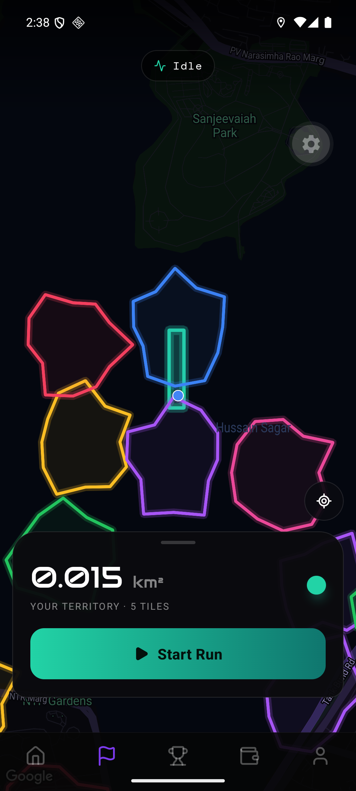
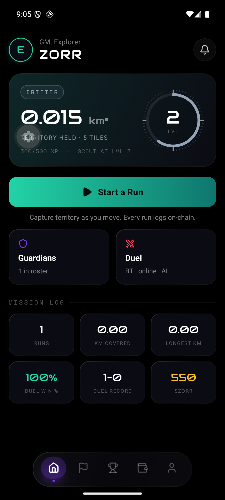
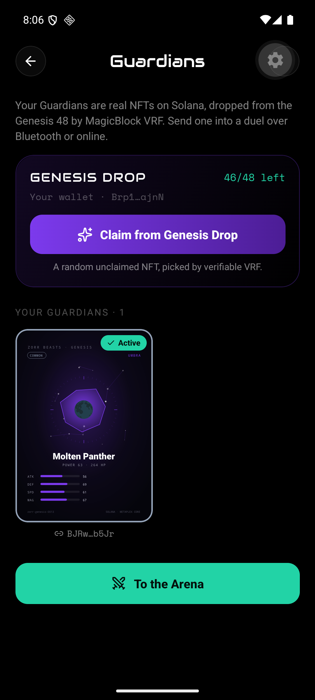
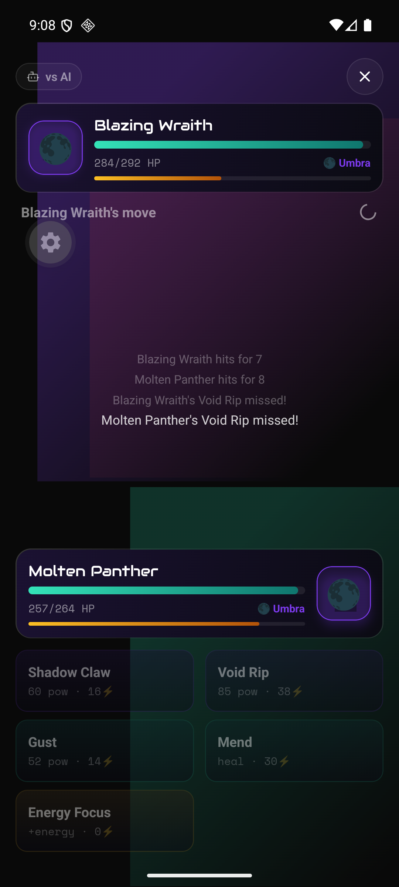
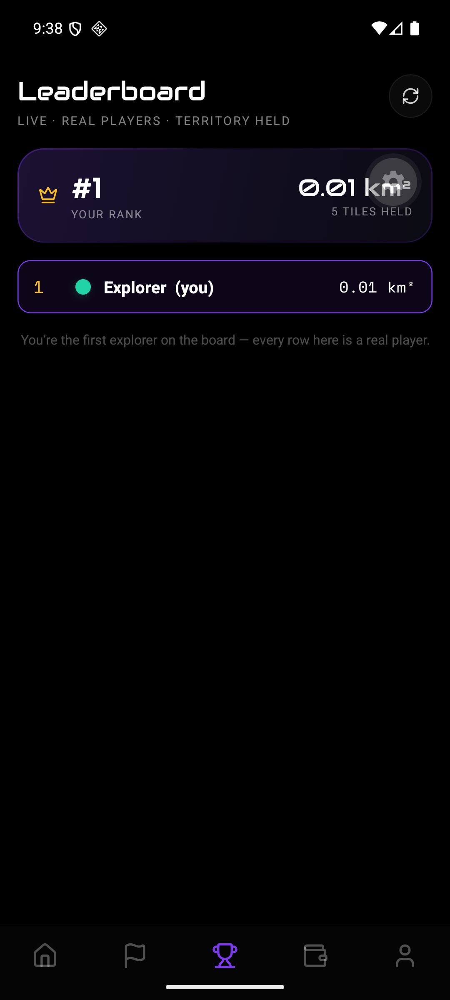

# Zorr — Walk & Capture the Land

**A real-time GPS territory game on Solana. Conquer your city on foot — and every run is a real on-chain transaction.**

Built for **Solana Blitz v6 (MagicBlock)**, Mobile theme.

| Empire map | Command console | Genesis claim (VRF NFT) | Guardian duel | Live leaderboard |
|---|---|---|---|---|
|  |  |  |  |  |

## Why this wins the Mobile track

- **Two MagicBlock products, both live on one deployed program** — Ephemeral Rollups (gasless ~100 ms
  captures, committed to Solana) and VRF (provably-fair NFT drops + trustless battle seeds), each
  proven by live devnet tests you can run yourself.
- **Real assets, zero mocks** — 48 Metaplex Core NFTs with Arweave art, a VRF drop that transfers
  them, a leaderboard of real devices (Mongo-backed), the official Privy modal + embedded wallets.
- **A game you play with your body** — GPS territory with anti-cheat, glowing rival empires,
  deterministic PvP over Bluetooth or the internet. Built native (Expo dev client), verified
  end-to-end on-device throughout this repo's commit history.

Zorr is an INTVL-style running game: you **Start a Run**, and the ground you physically cover becomes your territory (measured in km²). Rival clans hold part of the map — run through their tiles to steal them. An AI/heuristic anti-cheat blocks GPS spoofing and vehicles, so only real movement counts. End a run and **log it on-chain to Solana** — your territory is backed by a verifiable transaction.

## The loop

1. **Start a Run** → your GPS path auto-captures tiles as you move.
2. **Steal rival ground** → running through a rival tile flips it to your color (2× XP).
3. **Live stats** → km² captured, distance, duration, pace — with a pulsing recorder.
4. **End Run → summary** → area + XP, rate how it felt.
5. **Log run on-chain** → a real, confirmed Solana devnet transaction.
6. **Climb the weekly leaderboard** by km² held.

## Why on-chain (the MagicBlock story)

Territory games like INTVL keep your progress on their servers. In Zorr, **every capture is a real Solana transaction** signed by a session/game wallet — no popups per action.

Per-tile claims run on a **MagicBlock Ephemeral Rollup**: a delegated `territory` PDA is captured **on the ER** (gasless, ~50–150 ms), then committed back to Solana devnet. This is **built and proven**, not a roadmap item — see below.

### MagicBlock Ephemeral Rollup — implemented ✅

- **Program:** [`BSDY7ZusGE7372ydW7K8BuE8ZoiYumTBrAR9uymPGL1F`](https://explorer.solana.com/address/BSDY7ZusGE7372ydW7K8BuE8ZoiYumTBrAR9uymPGL1F?cluster=devnet) — a custom Anchor program using `#[ephemeral]` / `#[delegate]` and the `ephemeral-rollups-sdk` (`initialize` / `delegate` / `capture_tile` / `commit` / `undelegate`).
- **ER endpoint:** `https://devnet-as.magicblock.app` · **validator** `MAS1Dt9qreoRMQ14YQuhg8UTZMMzDdKhmkZMECCzk57`.
- **Flow:** `initialize` → `delegate` PDA to the ER → `capture_tile` **on the ER** (gasless) → `commit` state back to devnet base layer.
- **Proven:** the full delegate → gasless capture → commit path passes live on devnet via `onchain/tests/zorr-er.ts` (~154 ms capture), and standalone via `@solana/kit` (~51 ms). In the app, `src/features/chain/er.ts#captureTileOnER` builds the same instruction and posts it to the ER, with a devnet memo tx as fallback.

### MagicBlock VRF — implemented ✅

Verifiable randomness from the MagicBlock VRF oracle, on the **same program**. Two `#[vrf]` instructions (`ephemeral-rollups-sdk 0.15.5`, `vrf` feature) request randomness and receive it via an oracle callback:

- **Flow:** `request_seed(scope)` CPIs the base-layer VRF oracle queue (`Cuj97ggr…`) → the oracle calls back `callback_seed(randomness)` (guarded so only the VRF program identity can fulfill) → 32 verifiable bytes land in a scoped `VrfSeed` PDA.
- **Proven live:** `onchain/tests/zorr-vrf.ts` (`npm run test:vrf`) — request → oracle callback fulfilled in **~700 ms** → PDA holds real non-zero randomness.
- **Two uses in the app** (`src/features/chain/vrf.ts`, built in `@solana/kit`):
  - **Provably-fair summon** — a Guardian's element/rarity/stats derive from a VRF seed, so nobody can grind for Legendaries.
  - **Trustless battle seed** — a peer duel's RNG is seeded by VRF (host-authoritative + on-chain verifiable), replacing the players' nonces. Falls back to the deterministic seed if VRF is unreachable, so play never blocks.

### Real Zorr Beast NFTs — Genesis drop + VRF claim ✅

The Guardians are **real NFTs**, not local data. A Genesis collection of **48 Zorr Beasts** is minted as **Metaplex Core** NFTs on devnet, and players claim them by a **VRF-fair drop**.

- **Collection:** [`76hkTNNZ…TtvJr`](https://explorer.solana.com/address/76hkTNNZguBGc1fg7nKaKZXcbVAy1rrKY5uPFr9TtvJr?cluster=devnet) — 48 Guardians (8 per element; 21 Common / 12 Rare / 12 Epic / 3 Legendary). Art + metadata on **Arweave** (Irys). Each NFT's key trait is its **seed**, so the app derives identical battle stats from chain — one source of truth, no mock (the `nft/` port is verified byte-identical to the app engine).
- **Distinctive art:** procedural "neon cartography" trading cards (`nft/src/art.mjs`) — a unique seeded constellation + element orb + rarity frame per beast. (Puter AI-art can't run headless — its User-Pays model needs an interactive signed-in browser — so `nft/puter-art-tool.html` lets you regenerate with real AI art on demand.)
- **The drop = a VRF "contract that sends the NFTs":** `nft/src/claim-relay.mjs` holds the pool; on `POST /claim {owner}` it draws a random unclaimed beast with **MagicBlock VRF** and **transfers that real NFT** to the player. A ledger prevents double-claims.
- **In the app:** the Guardians screen shows the live pool + your device wallet, and **Claim from Genesis Drop** performs the VRF claim; owned NFTs render from their Arweave card art and are the fighters in duels. **Verified live on device:** claimed "Molten Panther" via VRF → NFT transferred → card rendered → Arena fought with it (stats from the on-chain seed).
- **Build/run:** `cd nft && npm run curate && npm run mint` (mint the 48), `npm run relay` (drop service). Point `EXPO_PUBLIC_CLAIM_RELAY_URL` at the relay.

## Guardian duels (NFT monsters) ⚔️

Your captures earn **Guardians** — NFT monsters you battle with, ported from AlgoQuest's beast system (six elements, a type-effectiveness chart, stats, four abilities + Energy Focus, burn/poison). Summon them on the Guardians screen (traits **sealed by MagicBlock VRF** — provably fair) and duel three ways:

- **Quick Duel** vs a deterministic AI, **Bluetooth** vs a nearby player (Google Nearby), or **Online** over a room code.
- **Turn-based:** pick a move, type advantage + stats + crits decide it; 30-second turns; winner takes the XP.

The hard part of a serverless PvP game is that both phones must agree on the outcome. Zorr solves it by making the battle a **deterministic reducer driven by a shared seed** — no `Math.random()` in a fight, and the only thing on the wire is *which ability index* was chosen (never damage numbers). A Guardian is fully defined by its seed, so it travels as a tiny `B:<seed>` message and the peer reconstructs it exactly.

- **Engine/model/transports:** `src/features/beasts/*` (element chart, seed→beast), `src/features/battle/monster-duel.ts` (AlgoQuest's damage math, deterministic), `protocol.ts`, `use-nearby.ts` (Bluetooth), `use-socket.ts` (online). Relay: `server/relay.mjs` (`npm run relay`).
- **Proven without hardware:** a two-device **loopback** test runs two engine instances through the wire protocol and asserts they stay byte-for-byte in sync and agree on the winner; a live **socket** test spawns the real relay and checks room-scoped ordered delivery + isolation (`npm run test:socket`).

## Features

- Real device **GPS** + live **Google Maps** (dark, neon-glow territory)
- **Anti-cheat**: speed/activity gating (Idle/Walking/Running/Vehicle)
- **Run sessions** with distance/duration/pace + km² territory
- **Rival clans** — contested tiles you steal by running
- **Guardian duels** — NFT-monster battles vs AI, Bluetooth, or online (room code)
- **Lifetime metrics** — runs, km covered, longest run, duel record + win rate, summons; a
  cartography **rank ladder** (Drifter → Scout → Pathfinder → Cartographer → Warden → Overseer →
  Sovereign) and 12 achievements
- **Signature HUD** — a compass-rose level ring (60 bearing ticks, progress as a sweep from due
  north) on a neon-cartography map: near-black board, violet arterials, emerald territory glow
- **Weekly leaderboard** (your rank is live from your captured km²)
- **XP, levels, combos, achievements, player identity** (name + color)
- **Real on-chain run logging** (Solana devnet, verified)
- Embedded wallet via **Privy** (email) or **guest** mode; funded game wallet for signing
- Rich UI throughout: animated aurora login, gradient-border cards, Audiowide + mono type

## Tech stack

- **Expo 55 / React Native 0.83** (expo-router)
- **@solana/kit** for transactions/signing, **react-native-maps** (Google), **expo-location**
- **Privy** embedded Solana wallet + guest mode
- **react-native-reanimated** for motion; dark "neon cartography" design system

## Run it

```bash
npm install
cp .env.example .env          # fill in Google Maps key + game wallet secret (see .env.example)
npm run android               # native dev build on an Android device/emulator
```

Notes:
- Needs an Android device/emulator (Mobile Wallet Adapter + native modules; no Expo Go / iOS sim).
- Fund the game wallet address (shown in the Wallet tab) with devnet SOL to make claims land.
- Guest mode works with no Privy setup; email login needs `com.zorr.app` allow-listed in the Privy dashboard.

## Tests

```bash
npm test                   # 49 unit tests (jest-expo) — tiles, rivals, leaderboard,
                           # run helpers, level curve, on-chain encoding, VRF seed
                           # helpers, the element chart + seed→beast generation, and the
                           # monster-duel engine (damage math, protocol, host election)
                           # with a two-device loopback proving both phones stay in sync
npm run test:integration   # live devnet: program deployed + executable, territory PDA
                           # exists, capture_tile encoding matches the IDL
npm run test:socket        # spawns the real relay; checks room-scoped ordered delivery
```

On-chain (in `onchain/`): `npm run test:vrf` drives the live VRF request → oracle callback on
devnet; the ER write path (delegate → gasless capture → commit) lives in `tests/zorr-er.ts`.

## Status (honest)

Done and verified: onboarding/login (**Privy** email OTP + embedded Solana wallet, or guest),
GPS + maps + anti-cheat, run sessions, rivals, leaderboard, wallet/profile/settings,
**real on-chain run logging** (confirmed devnet tx), **two MagicBlock products** on one deployed
program — **Ephemeral Rollups** (delegated, gasless capture + commit) and **VRF** (verifiable
randomness) — and **48 real Zorr Beast NFTs** (Metaplex Core, Arweave art) that players **claim via a
VRF drop** and battle with — all proven live on devnet.

The **Guardian duel** is complete: NFT-monster battles vs a deterministic AI, over **Bluetooth**
(Google Nearby), and **online** over a room code via the relay. The engine is a deterministic,
seed-driven reducer (AlgoQuest's damage math ported faithfully), so two phones compute identical
results and only the chosen ability index crosses the wire. Fairness is proven by a two-device
loopback test (byte-for-byte sync + winner agreement) and the transport by a live socket test that
spawns the real relay; runtime Bluetooth/location permissions are declared and requested. Two things
software can't self-check: the Bluetooth radio pairing between two physical phones, and a
public relay host for online play (run `npm run relay` and set `EXPO_PUBLIC_RELAY_URL`) — both are
deployment/QA steps, not code gaps.

**Verified live on the Android emulator** (dev-client + Metro): the neon-cartography map with GPS
lock + territory hull + rival patches (this run caught and fixed a real bug — react-native-maps'
LATEST renderer ignores `customMapStyle`, so the map pins `googleRenderer="LEGACY"`), a full
Guardian duel vs AI played to **Victory (+300 XP)**, and the Mission Log updating from it
(record 1–0, win rate 100%, $ZORR 250→550, compass ring sweeping 300/500). **Privy verified
on-device**: the SDK initializes with our App ID/Client ID (wallet tab shows live guest status +
sign-in path; the embedded wallet card surfaces the address once email-authed). The email OTP
round-trip itself needs a human inbox — that's the one Privy step outside headless reach.

`tsc` 0 errors · eslint 0 warnings · 61/61 unit tests · devnet + VRF + socket integration green · full Metro bundle.
